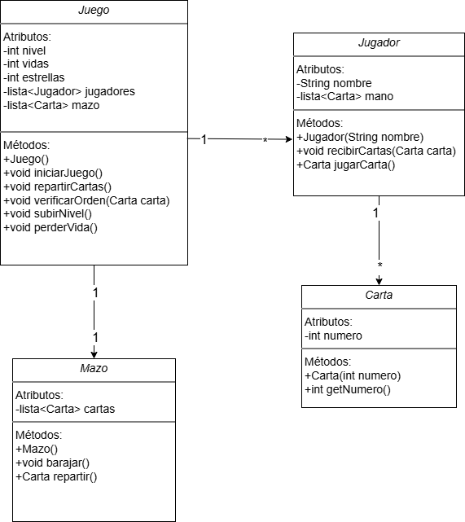

# TheMind
Este proyecto es una implementación del juego "The Mind" en C++.
Basados en el reglamento oficial: https://lajuganera.cat/wp-content/uploads/2020/08/Reglament-the-mind.pdf
## Diagrama UML
